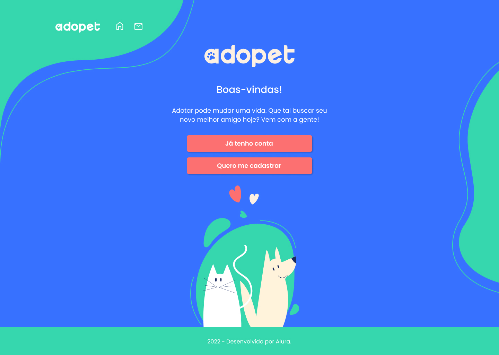
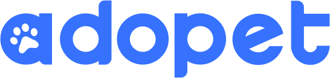

  

  <a href="https://adopet-xi.vercel.app/">Link</a> &nbsp;&nbsp;&nbsp;|&nbsp;&nbsp;&nbsp;
  <a href="#-sobre">Sobre</a> &nbsp;&nbsp;&nbsp;|&nbsp;&nbsp;&nbsp;
  <a href="#-challenge">Challenge</a> &nbsp;&nbsp;&nbsp;|&nbsp;&nbsp;&nbsp;
  <a href="#-tecnologias">Tecnologias</a> &nbsp;&nbsp;&nbsp;|&nbsp;&nbsp;&nbsp;
  <a href="#-sprints">Sprints</a> 

---

## 📌 Sobre

  

A empresa AdoPet têm como objetivo fazer o intermédio entre adotantes de animais e ONGs que possuem foco de retirar animais da rua. Visando isso, ela precisa trazer mais usuários e aumentar a interação entre possíveis adotantes e representantes dessas ONGs e para isso, deseja implementar uma plataforma e levar a empresa pro mundo digital.

## 🚀 Challenge 
Desenvolver em 4 semanas a versão das telas do usuário adotante para o site da AdoPet, que contará com página de login, cadastro, lista de pets e formulário de mensagem. 
O projeto deve ser desenvolvido em sprints com duração de 1 semana cada. 

Período: 22 de junho a 02 de agosto;

#alurachallengefrontend4

## 🔨 Tecnologias
As ferramentas e tecnologias eram de livre escolha. Eu escolhi desenvolver o projeto com:

<ul>
  <li>React</li>
  <li>React router dom</li>
  <li>Styled components</li>
</ul>

## 🏃 Sprints

<ul>
  <li>
    Semana 1 - Criando um site: a metodologia mobile-first
    <a href="https://trello.com/b/Ie7GgNOS/challenge-front-end-adopet-semana-1-mobile-first">Trello</a>
    ✔️
  </li>
  <li>
    Semana 2 - Avançando no projeto: adaptando para telas maiores
    <a href="https://trello.com/b/qjZU9naU/challenge-front-end-adopet-semana-2-responsividade">Trello</a>
    <!-- ✔️ -->
  </li>
  <li>Semana 3</li>
  <li>Semana 4</li>
</ul>

<!-- 
:heavy_check_mark: 
✔️
:x:
-->
